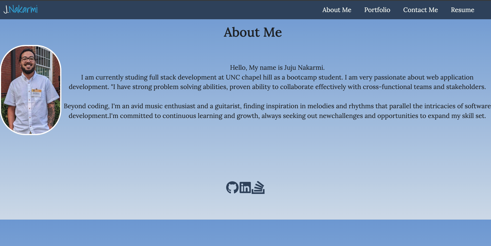
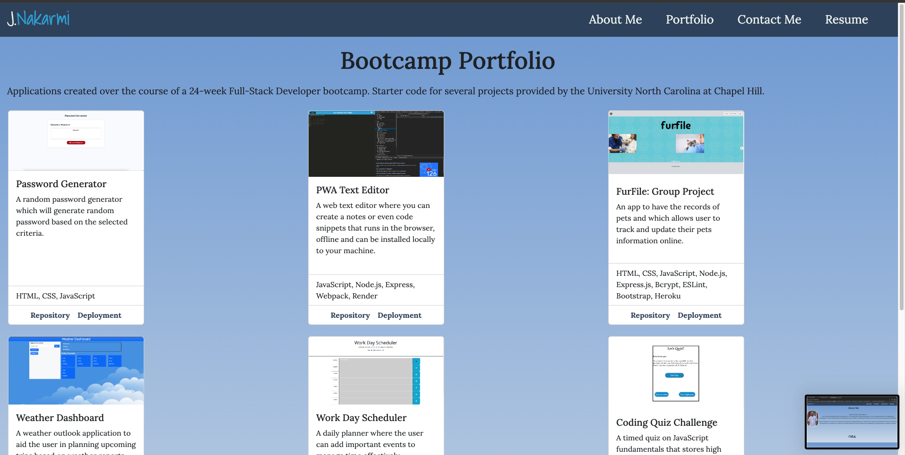
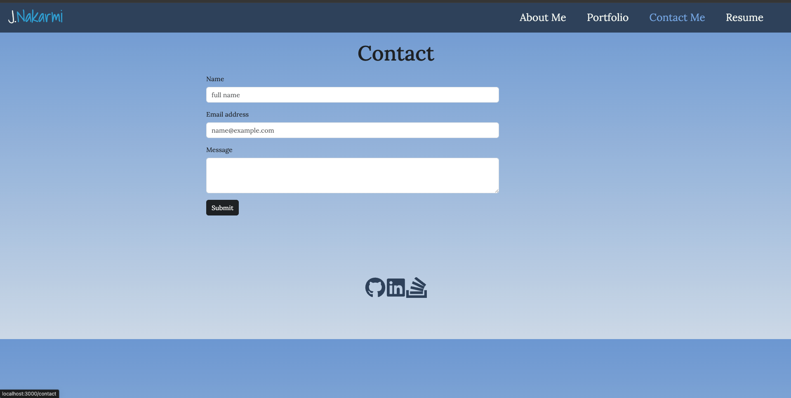

# React Portfolio
 
 
 

 
  

## Description
Welcome to my personal portfolio website! Built using React, HTML, CSS, and JavaScript, this project showcases my skills and projects as a web developer. Visitors can explore my professional background, view detailed descriptions of my projects, and get in touch through an integrated contact form. The portfolio highlights my proficiency in front-end development and demonstrates my ability to create dynamic and engaging user interfaces.

  ## Table of Contents

* [Installation](#installation)
* [Usage](#usage)
* [Screenshots](#screenshots)
* [License](#license)
* [Contributing](#contributing)
* [Contact](#contact)

## Installation
Clone the repository to your local repository.
```
1. Clone or Fork this repo.
1. Open the intergrated terminal.
2. npm install to install all depenpencies.
3. npm run dev to to open the app on local host.
```

## Usage
After cloning and installing it can run in localhost:3000.
OR
Direct Link for Netlify:
```
https://main--stirring-buttercream-8654c6.netlify.app/resume
```


## Screenshots
Here are some of the screenshots of the application.





## License
[](https://opensource.org/licenses/MIT)

## Contributing

There are no guidelines for contributing at this time. Contact me with any ideas or requests if anybody want to contribute.


## Contact
* Email: jujunakarmi@gmail.com
* LinkedIn:[https://www.linkedin.com/in/juju-nakarmi-1a79a7181/](https://www.linkedin.com/in/juju-nakarmi-1a79a7181/)